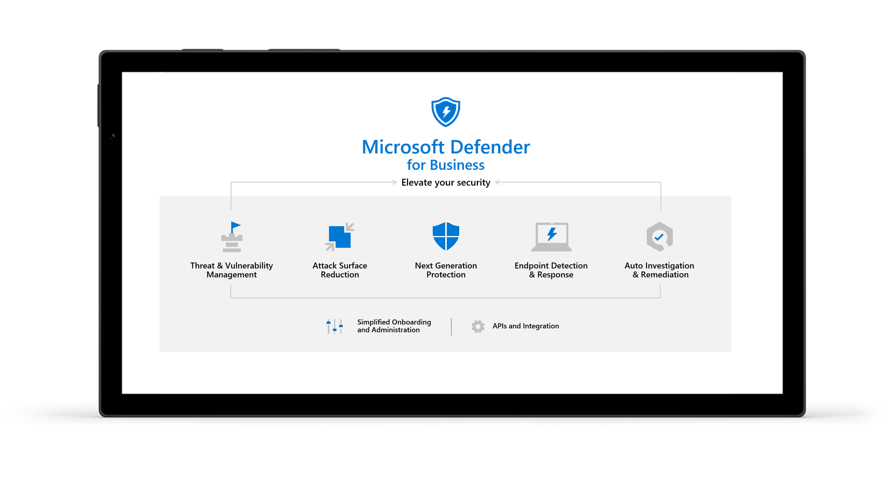
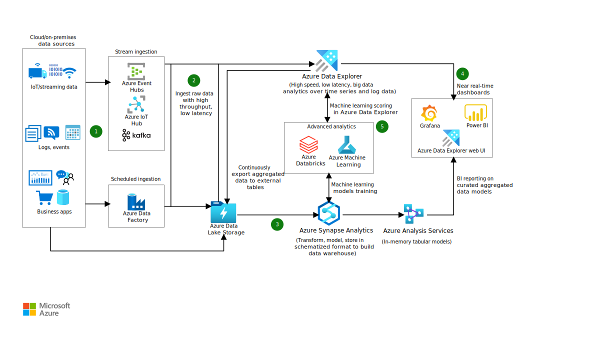

<details>
  <summary>Iniciando</summary>

# AZ-900

40 a 60 questões
85 minutos, em média 1 minuto e 40 segundos por questão
pontos de 1 a 1000, são necessários 700 pontos para passar

Pagamento e Agendamento via página da microsoft

Recomendou fazer pela Pearson Vue

Recursos
Computador
Ambiente deve ser um local privado e sem distrações
Documento de identificação com foto
Check In 30 minutos antes do horário marcado.

https://home.pearsonvue.com/Test-takers/Resources.aspx

Portal Azure

https://azure.microsoft.com/pt-br/free

Clicar em "Confira Todos os Serviços Gratuitos"

# Modelos de Cloud

IAAS - Infraestrutura como serviço
PASS - Plataforma como serviço
SAAS - Software como serviço

O IAAS alugamos a infraestrutura, ou seja, temos servidores físicos, mas não precisamos nos preocupar com a manutenção, pois a empresa que alugamos é responsável por isso.
O PAAS alugamos a plataforma, ou seja, temos servidores físicos e também o sistema operacional, mas não precisamos nos preocupar com a manutenção, pois a empresa que alugamos é responsável por isso. Aqui a aplicação é usada, Como por exemplo o Cosmo DB.
O SAAS alugamos o software, ou seja, temos servidores físicos, sistema operacional e o software, mas não precisamos nos preocupar com a manutenção, pois a empresa que alugamos é responsável por isso. Como por exemplo o Office 365.

### Leitura Complementar - Modelos de Cloud

Quais são os diferentes tipos de serviços de computação em nuvem?

Os tipos de computação em nuvem são modelos de implantação de serviço que permitem a seleção do nível de controle sobre as informações e tipos de serviço que precisam ser fornecidos. Há três tipos principais de serviços de computação em nuvem, às vezes chamados de pilha de computação em nuvem, pois são compilados um sobre o outro.

O primeiro tipo de computação em nuvem é a infraestrutura como serviço (IaaS), usada para acesso à recursos de computação e armazenamento baseados na Internet. Sendo a categoria mais básica entre os tipos de computação em nuvem, a IaaS permite que você alugue uma infraestrutura de TI (servidores e máquinas virtuais, armazenamento, redes e sistemas operacionais) de um provedor de nuvem em uma base paga conforme o uso.
https://azure.microsoft.com/pt-br/overview/what-is-iaas/

O segundo tipo de computação em nuvem é a plataforma como serviço (PaaS), que dá aos desenvolvedores as ferramentas necessárias para criar e hospedar aplicativos Web. A PaaS foi desenvolvida para proporcionar aos usuários o acesso aos componentes necessários para desenvolver e operar rapidamente aplicativos Web ou móveis na Internet, sem se preocupar com a configuração ou gerenciamento da infraestrutura subjacente dos servidores, armazenamento, redes e bancos de dados.
https://azure.microsoft.com/pt-br/overview/what-is-paas/

O terceiro tipo de computação em nuvem é o software como serviço (SaaS), usado para aplicativos baseados na Web. O SaaS é um método de entrega de aplicativos de software na Internet, no qual os provedores de nuvem hospedam e gerenciam os aplicativos de software, fazendo com que seja simples ter o mesmo aplicativo em todos seus dispositivos de uma só vez por meio da nuvem.
https://azure.microsoft.com/pt-br/overview/what-is-saas/

A Azure é excelente nos 3 tipos.

# Tipos de Cloud

Private - Nuvem privada, é uma nuvem que é usada apenas por uma organização, ou seja, é uma nuvem que é usada apenas por uma empresa. Temos que fazer um contato com um data center, fazer um co-location, ou seja, alugar um espaço no data center, e colocar nossos servidores lá. Temos que nos preocupar com licenças, hardware, manutenção, etc. Usado por bancos, governos etc.

Public - Nuvem pública, é uma nuvem que é usada por várias organizações, ou seja, é uma nuvem que é usada por várias empresas. Azure, AWS e Google Cloud são exemplos de nuvens públicas. Não temos que nos preocupar com licenças, hardware, manutenção, etc. Usado por empresas de pequeno, médio e grande porte. Não quer dizer que todo mundo acessa nossos dados, quer dizer que a nuvem é publica e pode ser contratada por qualquer empresa.

Hybrid - Nuvem híbrida, é uma nuvem que é usada por várias organizações, ou seja, é uma nuvem que é usada por várias empresas, mas que também pode ser usada por uma única organização. Podemos usar uma VM e dentro desta VM ter um software privado.

O private é o mais caro dos 3 tipos, o public é o mais barato dos 3 tipos e o hybrid é o intermediário.

## Leitura Complementar - Tipos de Cloud

### O que é nuvem privada?

Uma nuvem privada consiste em recursos de computação em nuvem usados exclusivamente por uma única empresa ou organização. A nuvem privada pode estar localizada fisicamente no datacenter local da sua organização ou pode ser hospedada por um provedor de serviços terceirizado. Mas em uma nuvem privada, os serviços e a infraestrutura são sempre mantidos na rede privada e o hardware e o software são dedicados unicamente à sua organização.

Dessa forma, com a nuvem privada é mais fácil para que a organização personalize seus recursos a fim de atender a requisitos de TI específicos. As nuvens privadas geralmente são usadas por órgãos governamentais, instituições financeiras e outras organizações de grande porte com operações críticas para os negócios, que buscam melhorar o controle sobre seu ambiente.

Vantagens de uma nuvem privada:

Maior flexibilidade – sua organização pode personalizar seu ambiente de nuvem para atender a necessidades de negócios específicas.

Maior controle – os recursos não são compartilhados com outros usuários, portanto, é possível um nível maior de controle e privacidade.

Maior escalabilidade –nuvens privadas geralmente oferecem mais escalabilidade em comparação com a infraestrutura local.

### O que é uma nuvem pública?

As nuvens públicas são a maneira mais comum de implantação da computação em nuvem. Os recursos de nuvem (como servidores e armazenamento) pertencem a um provedor de serviço de nuvem terceirizado, são operados por ele e entregues pela Internet. Com uma nuvem pública, todo o hardware, software e outras infraestruturas de suporte são de propriedade do provedor de nuvem e gerenciadas por ele. O Microsoft Azure é um exemplo de nuvem pública.

Em uma nuvem pública, você compartilha os mesmos dispositivos de hardware, de armazenamento e de rede com outras organizações ou "locatários" da nuvem e acessa serviços e gerencia sua conta usando um navegador da Web. As implantações de nuvem pública geralmente são usadas para fornecer email baseado na Web, aplicativos de escritório online, armazenamento e ambientes de desenvolvimento e teste.

Vantagens das nuvens públicas:

Redução de custos – não há necessidade de comprar hardware ou software e você paga somente pelos serviços que usa.

Sem manutenção – seu provedor de serviços fornece a manutenção.

Escalabilidade quase ilimitada – recursos sob demanda estão disponíveis para atender às suas necessidades de negócios.

Alta confiabilidade – uma ampla rede de servidores assegura contra falhas.

### Computação em nuvem híbrida

Uma nuvem híbrida é um tipo de computação em nuvem que combina uma infraestrutura local ou nuvem privada com uma nuvem pública. As nuvens híbridas permitem que os dados e aplicativos se movam entre os dois ambientes.

Muitas organizações adotam a abordagem de nuvem híbrida devido a exigências comerciais, por exemplo, para atender a requisitos regulatórios e de soberania de dados, aproveitar ao máximo o investimento em tecnologia local ou lidar com problemas envolvendo latência baixa.

A nuvem híbrida está evoluindo para incluir cargas de trabalho de borda também. A computação de borda traz a potência de computação da nuvem para dispositivos IoT, mais perto de onde os dados residem. Ao mover as cargas de trabalho para a borda, os dispositivos gastam menos tempo se comunicando com a nuvem, o que reduz a latência e permite a eles até mesmo operar de maneira confiável por períodos offline estendidos.

Espero que tenha gostado :)

## Leitura Complementar - 5 benefícios de Cloud

1. Flexibilidade

Para executar com eficácia uma estratégia de transformação digital, uma empresa precisará girar seu processo de negócios várias vezes. A computação em nuvem poupa uma organização do trabalho de investir em vários recursos de TI, fornecendo recursos de computação, infraestrutura, banco de dados e plataformas em trânsito. Isso permite que uma empresa seja ágil e flexível.

2. Custo-benefício

Juntamente com a flexibilidade de ajustar os requisitos, a nuvem oferece um modelo de serviço escalável, em que uma empresa paga apenas pelos recursos usados. Assim, não apenas economiza o custo de capital na compra e no gerenciamento da infraestrutura de TI, mas também ajuda as empresas a dimensionar seus recursos com base nos requisitos.

3. Segurança

Se o seu banco de dados é armazenado internamente, você enfrenta constantemente o risco de perder informações críticas devido a violações de dados, desligamentos inesperados do sistema, desastres, ataques de cibercriminosos etc.

No caso de hospedagem em nuvem, você pode criar facilmente vários backups de seus dados. Isso é especialmente benéfico ao lidar com Big Data, pois as chances de falhas do sistema aumentam significativamente nesse caso.

4. Prototipagem rápida

Para que a transformação digital funcione e a cultura de inovação seja implantada, uma empresa precisa inovar, testar e repetir continuamente.

O cloud computing pode fornecer às empresas uma plataforma em que podem facilmente criar, testar e implantar aplicativos sem a necessidade de configurar uma infraestrutura complexa. Assim, durante a fase de transformação, uma empresa pode experimentar vários aplicativos em diferentes plataformas.

5. Melhor colaboração

A transformação digital exige que uma empresa se adapte a uma cultura de inovação e criatividade e deixe a antiga cadeia hierárquica de comandos. A computação em nuvem permite que os arquivos sejam acessados ​​de qualquer lugar e a qualquer momento.

Também é possível controlar o nível de autoridade do usuário, garantindo assim a delegação ideal. No geral, ajuda a criar uma atmosfera de colaboração e trabalho em equipe na empresa.

Todos esses benefícios sugerem claramente que, se você criar uma cultura de inovação em sua empresa, a nuvem é uma solução lógica e ideal.

</details>

<details>
  <summary>Estrutura Azure</summary>

# Regiões e Zonas de Disponibilidade

Região - É um local geográfico no planeta que contém um ou mais data centers. Por exemplo, a região Leste dos EUA contém data centers em Virgínia e Carolina do Norte.

Zona de disponibilidade - É um ou mais data centers em uma região que contém energia, rede e instalações independentes das outras zonas de disponibilidade da região. Por exemplo, a zona de disponibilidade 1 na região Leste dos EUA contém data centers em Virgínia e Carolina do Norte.

Em SP temos 3 data centers, caso aconteça um desastre em um data center, os outros 2 data centers continuam funcionando. Sempre que criamos uma VM em uma zona de disponibilidade, o Azure replica a VM para as outras zonas de disponibilidade. Caso aconteça um desastre em uma zona de disponibilidade, a VM continua funcionando nas outras zonas de disponibilidade e não percebemos nada. Isso ocorre pois a Azure tem links de fibra ótica entre os data centers com uma latência muito baixa.
A Azure tem no mínimo 3 zonas de disponibilidade em cada região.

https://azure.microsoft.com/pt-br/explore/global-infrastructure/geographies/#geographies

Neste link podemos ver as regiões e zonas de disponibilidade da Azure.

Podemos ver também os Produtos habilitados por região. Podemos haver regiões que não tem todos os produtos habilitados. E o valor dos produtos também pode variar de região para região.

Deve ser avaliado também onde estão os clientes, pois se os clientes estão em SP, não faz sentido criar uma VM em outra região, pois a latência será maior.

# Grupos de Recursos

Esta parte é mais virtual dentro da plataforma da azure.

Grupo de recursos - É um container que contém todos os recursos relacionados a uma solução. Podemos ter vários grupos de recursos dentro de uma assinatura. Podemos ter um grupo de recursos para cada solução, por exemplo, um grupo de recursos para o sistema de vendas, um grupo de recursos para o sistema de compras, etc.

Quando iniciamos um serviço na microsoft, temos que associar a um grupo de recursos. Podemos ter um grupo de recursos chamado "servers" por exemplo, ou "db". Dentro deste grupo de recursos podemos ter vários servidores, ou vários bancos de dados.

Pode ser feito por filiais da empresa também, por exemplo, um grupo de recursos para a filial de SP, um grupo de recursos para a filial de MG, etc.

Quando temos um grupo de recursos, podemos ver por cada um dos grupos de recuros os valores que estão sendo gastos, por exemplo, o grupo de recursos "servers" está gastando R$ 100,00, o grupo de recursos "db" está gastando R$ 200,00, etc.

Quem gerencia os recursos é o Azure Resource Manager ou ARM.

</details>

<details>
  <summary>Computacional</summary>
# Máquinas Virtuais

Criamos um grupo de recursos chamado "servers" por exemplo, e dentro deste grupo de recursos criamos uma VM.

Na criação da VM, temos várias etapas, Básico, Discos, Rede, Gerenciamento, Avançado, Marcas e Revisar + Criar.

Na etapa Básico, temos que escolher o nome da VM, o usuário, a senha, a assinatura, o grupo de recursos, a região, a zona de disponibilidade, a imagem, o tamanho, o disco gerenciado, a conta de armazenamento, o nome do disco, o tipo de conta de armazenamento, o local de armazenamento, o tipo de replicação, o tipo de rede, o endereço IP público, a rede virtual, o sub-rede, o endereço IP privado, a placa de rede, o nome DNS, o nome de domínio.

Criamos uma VM para demonstração e logo depois fizemos a exclusão da VM e do Disco do Sistema Operacional e as Interfaces de Rede. Caso não excluísse os recursos criados, iria continuar cobrando mesmo não usando.

A VM pode ser criada via az vm create no cli ou via jenkins.

Exemplo de script:

```
az vm create \
  --resource-group myResourceGroup \
  --name myVM \
  --image UbuntuLTS \
  --admin-username azureuser \
  --generate-ssh-keys
```

Para a criação de muitas VMs, é melhor usar o script, pois é mais rápido.

# Azure MarketPlace

O MarketPlace oferece imagens de VMs prontas para uso, por exemplo, temos imagens do Windows Server, do Ubuntu, do Red Hat, etc.

Temos uma imagem do WordPress por exemplo, que já vem com o WordPress instalado, e só precisamos configurar o banco de dados.

Podemos criar um Firewall da PaloAlto por exemplo, que já vem com o Firewall instalado. Esse pagamos a licença por exemplo.

A MarketPlace tem várias soluções implementadas.

# Scale Set

É um conjunto de máquinas virtuais idênticas, que são criadas para trabalhar em conjunto, por exemplo, um conjunto de máquinas virtuais para um sistema de vendas, um conjunto de máquinas virtuais para um sistema de compras, etc.

Podemos definir os parâmetros do scale set para que ele aumente ou diminua o número de máquinas virtuais de acordo com a demanda. O parâmetro pode ser consumo de CPU e memória por exemplo.

Quem controla o tráfego é o Load Balancer.

No scale set definimos o mínimo e máximo de VMs que queremos que fique rodando. A própria plataforma da azure irá aumentar ou diminuir o número de VMs de acordo com a demanda.

Não há custo extra por configurar o scale set.

Caso ocorra alguma falha na VM, o scale set irá criar uma nova VM para substituir a VM que falhou.

# APP Service

É um serviço que permite que você crie e hospede aplicativos Web, móveis, API e lógica rapidamente, sem gerenciar a infraestrutura. Ele oferece implantação contínua e dimensionamento automático, além de suportar vários idiomas, como .NET, .NET Core, Java, Ruby, Node.js, PHP, Python e Docker. O Azure App Service permite que você crie aplicativos e sites corporativos em escala.

O App Service é um serviço gerenciado, ou seja, não precisamos nos preocupar com a infraestrutura, pois a Azure faz isso para nós.

Pode ser executado no Kubernetes, no Windows, no Linux, etc.

O Còdigo pode acessar uma storage blob, um banco de dados, etc.

O App Service é pago por acesso, ou seja, se tivermos 1000 acessos, pagaremos por 1000 acessos.

# Containers

É uma forma de empacotar o código, as configurações e as dependências de um aplicativo em um único objeto. Os contêineres compartilham o sistema operacional do host e, portanto, são considerados mais leves que as VMs. Além disso, os contêineres são mais fáceis de criar e implantar.

Ao invés de subir o código em outra máquina, empacotamos o código em um container e subimos o container em outra máquina. Geramos uma imagem do container e subimos a imagem do container em outra máquina. Pode ser feito o deploy desta imagem.

A Azure usa o Azure Container Instance, ou ACI.

Podemos pesquisar por Azure Container no portal azure e veremos os serviços relacionados a containers.

# Azure Kubernetes Service (AKS)

É um serviço de orquestração de contêineres totalmente gerenciado que permite implantar, gerenciar e dimensionar aplicativos de contêiner sem esforço. Ele oferece um ambiente de desenvolvimento de contêineres com suporte nativo ao Kubernetes. O AKS é gratuito, você paga apenas pelos recursos de computação e armazenamento que usa.

O AKS é um serviço gerenciado, ou seja, não precisamos nos preocupar com a infraestrutura, pois a Azure faz isso para nós.

Os PODs são os containers que estão rodando no Kubernetes.

# Área de Trabalho Virtual do Azure (AVD)

Azure Virtual Desktop é um serviço de virtualização de área de trabalho e aplicativos que executa o Windows 10 em nuvem. Ele fornece aos usuários acesso remoto a aplicativos e desktops Windows hospedados em um data center do Azure de qualquer lugar do mundo.

O Pool de Hosts pode ser criado e permite que vários usuários acessem o mesmo Pool de Hosts. A vantagem é que podemos instalar os aplicativos em um único Pool de Hosts e todos os usuários terão acesso aos mesmos aplicativos.

A principal diferença entre a Área de Trabalho Virtual do Azure e a criação de VMs é que na Área de Trabalho Virtual do Azure, podemos criar um Pool de Hosts e vários usuários podem acessar o mesmo Pool de Hosts. Na criação de VMs, cada usuário teria que ter uma VM.

Não são somente as VMs que podem estar dentro da Área de Trabalho Virtual do Azure, podemos ter também desktops físicos.

# Aplicativo de Funções

Imagine que em um marketplace, receba 10.000 visitas por hora e dessas, 100 viram compras.

No marketplace, as 100 que viram compras, disparam um processo de criação de mensagem para um parceiro externo que irá entregar o produto.

Com o Aplicativo de Funções, podemos mover esta parte do código para o Aplicativo de Funções e não precisamos nos preocupar com a infraestrutura, ou seja, na nossa VM do MarketPlace não precisamos dimensionar o recurso para envio de mensagens.

A parte volátil da solução é colocada no Aplicativo de Funções. Caso não seja feita nenhuma venda, não haverá custo e o Aplicativo de Funções não estará rodando.

</details>

<details>
  <summary>Rede</summary>

# IPV4

É um endereço de 32 bits, ou seja, 4 bytes, ou seja, 4 octetos, ou seja, 4 números de 0 a 255.
Por ex. podemos ter 3 PCs, 10.1.1.1, 10.1.1.2, 10.1.1.3. Como eles tem o mesmo início, significa que estão na mesma rede.

Se colocarmos 10.1.1.1/16 por exemplo, significa que os 2 primeiros octetos são fixos e os 2 últimos octetos podem variar de 0 a 255. Ou seja, os 16 primeiros bits pertencem a rede e os outros 16 aos hosts.

ou seja, 10.1 é a rede e 1.1 é o host.

O IPV4 é usado dentro da estrutura da Microsoft Brasil.

# Criando uma VNET no portal Azure

Vamos montar uma rede própria para o nosso ambiente. Por exemplo a VNET "Dev".

Podemos criar duas VMs, Dev1 e Dev2, e colocar as duas VMs na VNET "Dev".

No portal Azure primeiro vamos criar a Rede, buscamos "rede" e escolhemos "redes virtuais".

Clicamos em "Adicionar" e preenchemos os campos.

A azure sugere 10.1.0.0/16. Para este exemplo está ok. Na criação é informado que podemos ter 65.536 endereços IP.

Na segurança vamos criar um Bastion Host, que vai nos possibilitar acessar as VMs de forma remota, passou o AzureBastionSubnet 10.1.2.0/24, para que a Azure utilize os 3 primeiros octetos para a rede e o último octeto para o host.

Caso ainda não tenha um endereço público podemos escolher "dev-public" para criar um endereço público.

# Criação das VMs na rede Dev

Criou 2 VMs Linux que sobem mais rápido que as VMs Windows. Pois só vamos testar ping.

Configurou a segurança com Senha ao invés de chave pública somente para simplificar.

Na parte de Rede, selecionou a rede "Dev".

Após a criação podemos ver que o IP assignado a VM.

# Conexão com as VMs

Vamos enviar um ping para 8.8.8.8 que é o DNS do Google para validarque temos conexão com a internet.

Abrimos a primeira máquina virtual e clicamos em "Conectar" e escolhemos "Bastion". Preenchemos login e senha e clicamos em "Conectar". Já abre o linux.

comandos no terminal:

```
sudo su
apt instal net-tools
ifconfig
```

O IP assignado foi o 10.1.0.4

Na interface do portal Azure, podemos ver os detalhes da VM, inclusive o IP assignado. Da segunda máquina ficou 10.1.0.5.

Agora entramos na VM1 e enviamos um ping para o DNS do Google e funcionou.

Enviamos um ping da Dev2 para 10.1.0.4 que é a Dev1 e funcionou.

Nas remoções, primeiro removeu as VMs.

Depois entrou em Redes Virtuais / Dev e aparecem as duas VMs e o Bastion. Removeu o Bastion e depois removeu os endereços das VMs de dentro da rede.

Depois removeu a Rede Virtual Dev. A exclusão do Bastion demora um pouco. Validou que a rede virtual Dev foi excluída, validou que as VMs foram excluídas tbm.

# Balanceador de Carga - Load Balancer

O Load Balancer é um serviço que distribui o tráfego entre várias máquinas virtuais ou servidores para melhorar o desempenho e a confiabilidade dos aplicativos. O Load Balancer fornece alta disponibilidade ao distribuir as solicitações de entrada entre duas ou mais máquinas virtuais do conjunto de máquinas virtuais. Cada máquina virtual no conjunto de máquinas virtuais recebe uma parte do tráfego de entrada.

O Load Balancer fica entre o FrontEnd e o BackEnd e pode ter regras, por exemplo se temos 2 VMs com recursos diferentes, podemos enviar 70% das requests para a VM1 e 30% para a VM2.

# VPN Gateway

O Gateway VPN é um serviço que permite conectar uma rede local a uma rede virtual do Azure. O Gateway VPN pode ser usado para enviar tráfego de rede entre redes virtuais do Azure e locais, entre redes virtuais do Azure e entre redes virtuais. O Gateway VPN usa o protocolo IPsec (Protocolo de Segurança da Camada de Internet) para criar uma conexão segura e criptografada (normalmente com uma chave de 256 bits), entre os recursos do Azure e os recursos locais.

Por exemplo temos servidores físicos na rede da empresa e temos servidores virtuais na Azure. Podemos criar uma VPN entre a rede da empresa e a Azure. Essa VPN vai circular as informações dentro de um túnel encriptado. Será encriptado na saída e decriptado na entrada.

# Application Gateway

O Application Gateway é um serviço de balanceamento de carga de aplicativos da Web que permite criar um gateway de aplicativo altamente disponível e dimensionável para aplicativos Web, APIs e funções. O Application Gateway fornece recursos de balanceamento de carga de camada 7 (HTTP/HTTPS), roteamento de tráfego, regras de back-end, regras de redirecionamento, SSL offloading/terminação e muito mais.

É uma melhora do Load Balancer que é de camada 4, ou seja, não tem regras de negócio. O Application Gateway é de camada 7, ou seja, tem regras de negócio. Por exemplo podemos ter uma VM que entrega as imagens e outra VM que entrega os vídeos para o front-end. Podemos ter uma regra que se o usuário acessar uma imagem, o Application Gateway envia a request para a VM que entrega as imagens, e se o usuário acessar um vídeo, o Application Gateway envia a request para a VM que entrega os vídeos.

Recomendou a leitura do link abaixo:
https://learn.microsoft.com/pt-br/azure/application-gateway/overview

# Express Route

O ExpressRoute é um serviço de conectividade de rede que permite criar conexões privadas entre a infraestrutura local e a rede do Azure ou o Microsoft Cloud. O ExpressRoute permite estabelecer conexões com a Microsoft, como Azure, Microsoft 365 ou Dynamics 365, em um ambiente de rede de camada 3. Os circuitos ExpressRoute não passam pela Internet pública.

Por exemplo se quisermos trafegar muitos terabytes de dados diariamente para o storage (empresa de streaming de vídeos por exemplo), não é viável trafegar pela internet, pois a internet é lenta. Podemos criar uma conexão privada entre a empresa e a Azure, e trafegar os dados por esta conexão privada.

O custo do ExpressRoute é alto, pois é uma conexão privada.

# CDN

O Azure Content Delivery Network (CDN) é um serviço de rede de entrega de conteúdo para entrega de conteúdo de alta largura de banda. Ele fornece uma maneira globalmente distribuída de fornecer conteúdo de sites de alto desempenho, como imagens, vídeos, arquivos de áudio, aplicativos, atualizações de software e outros arquivos da Web para os usuários finais, com alta disponibilidade e alto desempenho. O Azure CDN oferece suporte a conteúdo não somente do Azure, mas também de outros locais, como um data center local, e pode ser habilitado para conteúdo hospedado em qualquer lugar na Web.

CDN de maneira geral é uma rede de distribuição de conteúdo. Por exemplo, temos um site que tem muitas imagens, e estas imagens estão em um storage na Azure. Se o usuário acessar o site de SP, a imagem vai ser carregada de SP, se o usuário acessar o site de MG, a imagem vai ser carregada de MG, etc. Ou seja, a imagem vai ser carregada do local mais próximo do usuário. Isso é feito para melhorar a performance.

As CDNs ao redor do mundo se comunicam e trocam informações para saber onde está o conteúdo mais próximo do usuário.

Caso o conteúdo seja muito dinâmico e mude muito, não é recomendado usar CDN pois a cópia dos dados de uma CDN para outra demora um pouco.

</details>

<details>
  <summary>Armazenamento</summary>

# Blob Storage

O Azure Blob Storage é um serviço de armazenamento de objetos para armazenar grandes quantidades de dados não estruturados, como texto ou dados binários.
BLOB significa Binary Large Object.

Podemos armazenar por exemplo arquivos jpg, mp4, docs, xls, etc. Esses arquivos ficam armazenados em um container e o container fica dentro de uma storage account que é o Blob Storage.

Em uma VM podemos ter referências para o Blob Storage e acessar os arquivos. Nâo é necessário armazenar os arquivos na VM.

Temos 3 tipos de armazenamento na Azure:

- Hot: É o mais caro, mas é o mais rápido. É recomendado para arquivos que são acessados com frequência.
- Cool: É mais barato que o Hot, mas é mais lento. É recomendado para arquivos que são acessados com menos frequência. Os dados devem ser armazenados por no mínimo 30 dias antes de serem acessados, caso contrário será cobrado uma taxa de saída e será mais caro que o Hot.
- Archive: É o mais barato, mas é o mais lento. É recomendado para arquivos que são acessados com muita pouca frequência. Deve ser usado para backups. É normal deixar arquivos por anos sem acessar. Os dados devem ser armazenados por no mínimo 180 dias antes de serem acessados, caso contrário será cobrado uma taxa de saída e será mais caro que o Cool.

# Criando um Blob Storage

No portal Azure buscamos por Contas de Armazenamento e clicamos em "Adicionar". Pode ser que já exista uma conta de armazenamento, então clicamos em "Adicionar" e preenchemos os campos.

Criamos o Resource Group ou adicionamos a um existente, escolhemos o nome da conta de armazenamento, escolhemos a região, escolhemos o tipo de replicação, escolhemos o tipo de acesso, escolhemos o tipo de performance.

Podemos definir a redundância local, ou seja, os dados ficam em um data center, ou a redundância geográfica, ou seja, os dados ficam em vários data centers. Os custos são diferentes e vão aumentando de acordo com a redundância.

Em rede podemos definir se a conta de armazenamento vai ser acessada por qualquer rede, ou por uma rede específica, ou por uma rede virtual. Pode ser pública ou privada.

# Adicionando Arquivos ao container

Podemos fazer via web, baixar um software ou pelo Gerenciador de Armazenamento.
Ao entrar no Gerenciador de Armazenamentoi, vemos que não existe nenhum Conteiners de Blob criado. Criamos um container chamado "imagens" por exemplo e escolhemos o tipo de acesso, que pode ser privado, público ou restrito.

Após criar o blob, aparece uma interface para fazer upload de arquivos. Fizemos o upload de um arquivo jpg. Para visualizar podemos fazer o download ou clicar com o botão direito e nas propriedades do arquivo, copiar o link e colar no navegador. Ou ir direto no botão de copiar url após selecionar o arquivo.

# Gerenciamento de Discos

Quando criamos uma VM na Azure, é criado um disco para a VM. Podemos criar um disco de sistema operacional, um disco de dados, um disco de cache, etc.

Podemos depois adicionar um disco separado para armazenar os dados, pois se excluírmos a VM, não vamos perder os dados e podemos incluir em outra VM.

A Azure disponibiliza quatro tipos de discos:
HDD, Standard SSD, Premium SSD e Ultra Disk.
O HDD é usado para backups, pois é mais barato.
O Standard SSD é usado para arquivos que são acessados com menos frequência.
O Premium SSD é usado para arquivos que são acessados com mais frequência.
O Ultra Disk é usado para arquivos que são acessados com muita frequência e pode chegar a 64 TB.

Ao acessar a interface "Discos" no portal da Azure encontramos alguns discos, apesar de termos removido todas as VMs, os discos não foram removidos.

É possível alterar a configuração, o tamanho, desempenho etc.

Sempre que excluirmos uma VM, devemos nos certificar que os discos foram excluídos também.

</details>

<details>
  <summary>Banco de Dados</summary>

A Azure suporta o Cosmos Db, Azure SQL, MySQL, PostgreSQL, MariaDB, etc.

Na Azure podemos ter uma cópia do mesmo DB em regiões diferentes, por exemplo clientes do Brasil e Austrália podem acessar bancos nas regiões do Brasil e Austrália com os mesmos dados e a mesma performance.

# Cosmos DB

Criamos um banco de dados Cosmos DB (SQL), escolhemos a assinatura, o grupo de recursos, o nome do banco, a API, a região, a capacidade, o custo, a replicação, etc.

Na distribuição local podemos habilitar a redundancia geográfica, gravação de várias regiões e zonas de disponibilidade, tipo de rede, política de backup que pode ser periótica ou contínua, na contínua a cada modificação é feito um backup, na periódica é feito um backup a cada 5 minutos por exemnlo.

Quando criamos o banco é informado que as primeiras 1000 RU/s e 25Db de storage são gratuitos. RU/s é a quantidade de leituras e escritas por segundo. Ou seja, sempre que manter esses limites não haverá custos.

Após a criação apagamos o banco de dados e reforçou que a deleção é irreversível.

# Azure SQL

Para a criação do banco de dados SQL, não precisamos nos preocupar com a infraestrutura, definimos somente o tamanho máximo do nosso banco, que atualmente é de 100 Tb. Toda a parte de CPU e Memória da VM que vai suportar o banco é gerenciada pela Azure.

# Postgre SQL

O Banco de Dados do Azure para PostgreSQL
O que é o Banco de Dados do Azure para PostgreSQL?

O Banco de Dados do Azure para PostgreSQL é um serviço de banco de dados relacional no Microsoft Cloud com base no mecanismo de banco de dados PostgreSQL Community Edition (disponível sob a licença GPLv2). O Banco de Dados do Azure para PostgreSQL fornece:

Alta disponibilidade interna.

Proteção de dados usando backups automáticos e restauração pontual por até 35 dias.

Manutenção automatizada para hardware, sistema operacional e mecanismo de banco de dados subjacentes para manter o serviço seguro e atualizado.

Desempenho previsível, com preços pré-pagos inclusivos.

Dimensionamento elástico em segundos.

Segurança de nível corporativo e conformidade líder do setor para proteger dados confidenciais em repouso e em movimento.

Monitoramento e automação para simplificar o gerenciamento e o monitoramento para implantações em larga escala.

Experiência de suporte líder do setor.

Banco de Dados do Azure para PostgreSQLEsses recursos não precisam de quase nenhuma administração e todos são fornecidos sem nenhum custo adicional. Eles permitem que você se concentre no método RAD e em acelerar seu tempo de colocação no mercado, em vez de alocar tempo e recursos preciosos ao gerenciamento de máquinas virtuais e de infraestrutura. Além disso, você pode continuar desenvolvendo seu aplicativo com a plataforma e as ferramentas de software livre de sua escolha e pode fornecê-lo com a velocidade e a eficiência que sua empresa exige, tudo isso sem precisar aprender novas habilidades.

Modelos de implantação
O Banco de Dados do Azure para PostgreSQL desenvolvido com o PostgreSQL community edition está disponível em três modos de implantação:

Servidor único

Servidor Flexível (versão prévia)

Hiperescala (Citus)

# MySQL

O Azure SQL é da Microsoft, então pagamos uma taxa de uso de licença, o MYSQL é Open Source, na página mysql.com podemos visualizar as informações e as empresas que suportam o mysql.

O Mysql tem uma comunidade muito grande que o suporta e está sempre atualizado com os patches de segurança.

Usamos o MySQL como PAAS, ou seja, não precisamos nos preocupar com a infraestrutura, somente com o banco de dados. A Azure mantém uma disponibilidade de 99,99% do banco de dados.

Para acessar no portal da Azure, buscamos por "Servidores do Banco de Dados do Azure para MySQL".

# Migração

Digamos que tomamos a decisão de migrar um servidor de banco de dados local para a Azure. Podemos usar o Azure Database Migration Service para fazer a migração. O Banco de Dados local tem 20gb por ex. basta procurar pelo serviço de migração e seguir os passos informando os dados de acesso no banco local, a migração é bem rápida.

</details>

<details>
  <summary>Segurança</summary>

# Defense in Depth

Defesa em profundidade é uma estratégia de segurança que usa várias camadas de controles de segurança para proteger a rede e os sistemas. Cada camada de segurança implementa controles de segurança e políticas de segurança. Se uma camada de segurança for violada, as outras camadas de segurança ainda estarão em vigor.

A primeira camada da Azure é a camada Física, onde o acesso é restrito e monitorado.

A segunda camada é a Identidade e Acesso, onde temos o Azure Active Directory, MFA, etc. Também são registrados logs de modificações das contas contendo qual usuário fez a modificação, quando e o que foi modificado.

Após a identidade e acesso temos a camada de Perimeter, onde temos o Firewall.

Depois temos a parte de Rede, onde conseguimos filtrar a comunicação entre recursos que por default é negada e deve ser habilitada. Podemos restringir acessos da internet de entrada e saída.

A próxima camada é de Computação, onde temos o Bastion Host, acesso seguro somente via ssh, atualização do software e patches com as melhores práticas de segurança.

A próxima camada é de Aplicação, na camada de aplicação devemos ter certeza que todos os softwares estão atualizados, com firewall ligado, manter uma base de usuários e somente aqueles usuários podem acessar o sistema.

E por último os Dados, que normalmente são o alvo de qualquer ataque, podemos encriptar os dados, armazenar em blob storage etc, mesmo que consiga acessar os dados não vai conseguir ler o conteúdo dos dados.

Estas 7 camadas mantém a segurança da Azure.

# Firewall

O Firewall é essencial para a topologia de rede em cloud.

Na topologia (VNET) podemos ter as VMs, Blob, Banco de Dados, App, e Serviços de Rede. Para se comunicar com a internet, as VMs, Blob, Banco de Dados, App, e Serviços de Rede, precisam passar pelo Firewall. Para não precisar ter um entrypoint para cada serviço, podemos ter um único entrypoint que é o Firewall.

O Firewall da Azure é um serviço de segurança que protege sua rede de tráfego não autorizado. Ele atua como um filtro entre sua rede e a Internet, permitindo que o tráfego autorizado passe e bloqueando o tráfego não autorizado. O Firewall da Azure é totalmente gerenciado e baseado em nuvem, o que facilita a configuração e o gerenciamento.

O Firewall é um serviço SaaS, ou seja, não precisamos nos preocupar com a infraestrutura, somente com a configuração.

A regra principal do firewall é negar qualquer coisa de se comunicar com qualquer lugar, e aí vamos liberando o que queremos que se comunique com o que. As regras de firewall são unidirecionais, ou seja, se eu autorizo uma VM a enviar dados para a internet, a internet não pode enviar dados para a VM.

# Defender

Microsoft Defender para Nuvem
O que é o Microsoft Defender para Nuvem?

O Defender para Nuvem é uma ferramenta para gerenciamento de postura de segurança e proteção contra ameaças. Ele fortalece a postura de segurança dos seus recursos de nuvem, e, com seus planos integrados do Microsoft Defender, o Defender para Nuvem protege as cargas de trabalho em execução no Azure, em ambiente híbrido e em outras plataformas de nuvem.

O Defender para Nuvem fornece as ferramentas necessárias para proteger seus recursos, acompanhar sua postura de segurança, proteger contra ataques cibernéticos e simplificar o gerenciamento de segurança. Como é nativamente integrado, a implantação do Defender para Nuvem é fácil, fornecendo provisionamento automático simples para proteger seus recursos por padrão.

O Defender para Nuvem preenche três necessidades vitais à medida que você gerencia a segurança de seus recursos e cargas de trabalho locais e na nuvem:



# Key Vault

O Azure Key Vault é um serviço de segurança que permite armazenar e gerenciar chaves de criptografia, segredos e certificados. O Key Vault é projetado para proteger informações confidenciais, como chaves de criptografia, senhas, certificados e outros segredos. O Key Vault ajuda a controlar o acesso a essas informações e fornece uma camada adicional de segurança para suas chaves e segredos.

O Key Vault é um serviço gerenciado, ou seja, não precisamos nos preocupar com a infraestrutura, somente com a configuração.

Supondo que uma empresa terceira precise ter acesso a um banco de dados, ao invés de passar um usuário e senha do key vault, podemos passar uma credencial que dá acesso ao key vault e a empresa terceira pode pegar a credencial do key vault e acessar o banco de dados. A vantagem é que se o contrato com esta empresa for suspenso ou terminado, basta revogar a credencial do key vault e a empresa terceira não terá mais acesso ao banco de dados.

# Microsoft Sentinel

O Microsoft Sentinel
O que é o Microsoft Sentinel?
O Microsoft Sentinel é uma solução escalonável e nativa de nuvem que oferece SIEM (gerenciamento de eventos de informações de segurança) e SOAR (resposta automatizada para orquestração de segurança) . O Microsoft Sentinel oferece análise inteligente de segurança e inteligência contra ameaças em toda a empresa, com uma solução para detecção de alertas, visibilidade de ameaças, procura proativa e resposta a ameaças.

O Microsoft Sentinel é sua visão geral da empresa, amenizando o estresse de ataques cada vez mais sofisticados, volumes crescentes de alertas e longos períodos para resolução.

Colete dados na escala de nuvem de todos os usuários, dispositivos, aplicativos e infraestrutura, local e em múltiplas nuvens.

Detecte ameaças que ainda não foram descobertas e minimize [falsos positivos](https://docs.microsoft.com/pt-br/azure/sentinel/false-positives) usando a análise e a inteligência contra ameaças incomparáveis da Microsoft.

Investigue ameaças com inteligência artificial e busque por atividades suspeitas em escala, acessando anos de trabalho sobre segurança cibernética na Microsoft.

Responda a incidentes de forma rápida com orquestração interna e automação de tarefas comuns.

Principais recursos do Microsoft Sentinel


Aproveitando a gama completa de serviços existentes do Azure, o Microsoft Sentinel incorpora nativamente bases comprovadas, como o Log Analytics e os Aplicativos Lógicos. O Microsoft Sentinel enriquece a investigação e a detecção com IA, além de oferecer o fluxo de inteligência da Microsoft contra ameaças e permitir que você use sua própria inteligência contra ameaças.

</details>

<details>
  <summary>Soluções Azure</summary>

# IOT

A Internet das Coisas (IoT) do Azure

O que é a Internet das Coisas (IoT) do Azure?

A Internet das Coisas (IoT) do Azure é uma coleção de serviços cloud geridos pela Microsoft que ligam, monitorizam e controlam milhares de milhões de recursos de IoT. Em termos mais simples, uma solução IoT é composta por um ou mais dispositivos IoT que comunicam com um ou mais serviços de back-end alojados na cloud.

Dispositivos IoT
Um dispositivo IoT é normalmente composto por uma placa de circuito com sensores ligados que usam Wi-Fi para se ligar à internet. Por exemplo:

Um sensor de pressão numa bomba de óleo remota.

Sensores de temperatura e humidade numa unidade de ar condicionado.

Um acelerómetro num elevador.

Sensores de presença numa sala.

Há uma grande variedade de dispositivos disponíveis de diferentes fabricantes para construir a sua solução. Para obter uma lista de dispositivos certificados para trabalhar com o Azure IoT Hub, consulte o catálogo de dispositivos Azure Certified for IoT. Para prototipagem, pode utilizar dispositivos como um MXChip IoT DevKit ou um Raspberry Pi. O Devkit tem sensores incorporados para temperatura, pressão, humidade e um giroscópio, acelerómetro e magnetómetro. O Raspberry Pi permite-lhe anexar vários tipos diferentes de sensores.

A Microsoft fornece SDKs de dispositivo de código aberto que pode usar para construir as aplicações que executam nos seus dispositivos. Estes SDKs simplificam e aceleram o desenvolvimento das suas soluções IoT.

Comunicação
Normalmente, os dispositivos IoT enviam telemetria dos sensores para serviços de back-end na nuvem. No entanto, outros tipos de comunicação são possíveis, como um serviço de back-end enviando comandos para os seus dispositivos. Seguem-se alguns exemplos de comunicação dispositivo-a-nuvem e nuvem-para-dispositivo:

Um caminhão de refrigeração móvel envia temperatura a cada 5 minutos para um hub IoT.

O serviço back-end envia um comando a um dispositivo para alterar a frequência a que envia telemetria para ajudar a diagnosticar um problema.

Um dispositivo envia alertas com base nos valores lidos nos seus sensores. Por exemplo, um dispositivo que monitoriza um reator de lote numa instalação química, envia um alerta quando a temperatura excede um determinado valor.

Os seus dispositivos enviam informações para visualização num painel de instrumentos para visualização por operadores humanos. Por exemplo, uma sala de controlo numa refinaria pode mostrar os volumes de temperatura, pressão e fluxo em cada tubo, permitindo aos operadores monitorizar a instalação.

Os SDKs de Dispositivo IoT e o IoT Hub suportam protocolos de comunicação comuns como HTTP, MQTT e AMQP.

Os dispositivos IoT têm características diferentes quando comparados com outros clientes, como navegadores e aplicações móveis. Os SDKs do dispositivo ajudam-no a enfrentar os desafios da ligação dos dispositivos de forma segura e fiável ao seu serviço back-end. Especificamente, os dispositivos IoT:

São, frequentemente, sistemas incorporados sem nenhum operador humano (ao contrário de um telefone).

Podem ser implementados em localizações remotas, onde o acesso físico é dispendioso.

Podem apenas ser acessíveis através do back-end da solução.

Podem recursos de processamento e um poder limitados.

Podem ter uma conectividade de rede intermitente, lente ou dispendiosa.

Podem ter de utilizar protocolos de aplicação proprietários, personalizados ou específicos da indústria.

Serviços back-end
Numa solução IoT, o serviço back-end fornece funcionalidades como:

Receber telemetria à escala dos seus dispositivos e determinar como processar e armazenar esses dados.

Analisar a telemetria para fornecer insights, em tempo real ou após o facto.

Envio de comandos da nuvem para um dispositivo específico.

A provisionar dispositivos e a controlar quais os dispositivos que podem ligar à sua infraestrutura.

Controlando o estado dos seus dispositivos e monitorizando as suas atividades.

Gerir o firmware instalado nos seus dispositivos.

Por exemplo, numa solução de monitorização remota para uma estação de bombagem de óleo, a parte traseira da nuvem utiliza telemetria das bombas para identificar comportamentos anómalos. Quando o serviço de back-end identificar uma anomalia, pode enviar automaticamente um comando de volta ao dispositivo para tomar uma ação corretiva. Este processo gera um ciclo de comentários automatizado entre o dispositivo e a cloud, que aumenta significativamente a eficiência da solução.

# Azure Big Data

Azure Big Data
Estilo de arquitetura de Big Data
Uma arquitetura de Big Data foi projetada para lidar com ingestão, processamento e análise de dados grandes ou complexos demais para sistemas de banco de dados tradicionais.

Diagrama lógico de um estilo de arquitetura de Big Data

Soluções de Big Data normalmente envolvem um ou mais dos seguintes tipos de carga de trabalho:

Processamento em lote de fontes Big Data em repouso.

Processamento em tempo real de Big Data em movimento.

Exploração interativa de Big Data.

Análise preditiva e machine learning.

A maioria das arquiteturas de Big Data inclui alguns ou todos os seguintes componentes:

Fontes de dados: todas as soluções de Big Data começam com uma ou mais fontes de dados. Os exemplos incluem:

Armazenamentos de dados de aplicativo, como bancos de dados relacionais.

Arquivos estáticos produzidos por aplicativos, como arquivos de log do servidor Web.

Fontes de dados em tempo real, como dispositivos IoT.

Armazenamento de dados: dados de operações de processamento em lote normalmente são armazenados em um repositório de arquivos distribuído que pode conter amplos volumes de arquivos grandes em vários formatos. Esse tipo de repositório geralmente é chamado data lake. As opções para implementar esse armazenamento incluem contêineres de blobs ou Azure Data Lake Store no Armazenamento do Azure.

Processamento em lote: como os conjuntos de dados são muito grandes, geralmente uma solução de Big Data deve processar arquivos de dados usando trabalhos de lote de execução longa para filtrar, agregar e preparar os dados para análise. Normalmente, esses trabalhos envolvem ler arquivos de origem, processá-los e gravar a saída para novos arquivos. Opções incluem executar trabalhos de U-SQL no Azure Data Lake Analytics, usar trabalhos Hive, Pig ou de Mapear/Reduzir personalizados em um cluster HDInsight Hadoop ou usar programas de Java, Scala ou Python em um cluster HDInsight Spark.

Ingestão de mensagens em tempo real: se a solução inclui fontes em tempo real, a arquitetura deve incluir uma maneira de capturar e armazenar mensagens em tempo real para processamento de fluxo. Isso pode ser um armazenamento de dados simples, em que as mensagens de entrada são removidas para uma pasta para processamento. No entanto, muitas soluções precisam de um repositório de ingestão de mensagens para atuar como buffer de mensagens e dar suporte a processamento de expansão, entrega confiável e outras semânticas de enfileiramento de mensagem. Opções incluem Hubs de Eventos do Azure, Hubs de IoT do Azure e Kafka.

Processamento de fluxo: depois de capturar mensagens em tempo real, a solução deve processá-las filtrando, agregando e preparando os dados para análise. Os dados de fluxo processados são gravados em um coletor de saída. O Azure Stream Analytics oferece um serviço de processamento de fluxo gerenciado baseado em consultas SQL em execução perpétua que operam em fluxos não associados. Você também pode usar tecnologias de streaming Apache de software livre, como Storm e Spark Streaming em um cluster HDInsight.

Armazenamento de dados analíticos: muitas soluções de Big Data preparam dados para análise e então veiculam os dados processados em um formato estruturado que pode ser consultado usando ferramentas analíticas. O armazenamento de dados analíticos usado para atender a essas consultas pode ser um data warehouse relacional estilo Kimball, como visto na maioria das soluções de BI (business intelligence) tradicionais. Como alternativa, os dados podem ser apresentados por meio de uma tecnologia NoSQL de baixa latência, como HBase ou um banco de dados Hive interativo que oferece uma abstração de metadados sobre arquivos de dados no armazenamento de dados distribuído. O Azure Synapse Analytics fornece um serviço gerenciado para armazenamento de dados em larga escala baseado em nuvem. O HDInsight dá suporte a Hive interativo, HBase e Spark SQL, que também pode ser usado para veicular dados para análise.

Análise e relatório: a meta da maioria das soluções de Big Data é gerar insights sobre os dados por meio de análise e relatórios. Para capacitar os usuários a analisar os dados, a arquitetura pode incluir uma camada de modelagem de dados, como um cubo OLAP multidimensional ou um modelo de dados tabular no Azure Analysis Services. Também pode dar suporte a business intelligence de autoatendimento, usando as tecnologias de modelagem e visualização do Microsoft Power BI ou do Microsoft Excel. Análise e relatórios também podem assumir a forma de exploração de dados interativos por cientistas de dados ou analistas de dados. Para esses cenários, muitos serviços do Azure dão suporte a blocos de anotações analíticos, como Jupyter, permitindo que esses usuários aproveitem suas habilidades existentes com Python ou R. Para exploração de dados em larga escala, você pode usar o Microsoft R Server, seja no modo autônomo ou com Spark.

Orquestração: a maioria das soluções de Big Data consiste em operações de processamento de dados repetidos, encapsuladas em fluxos de trabalho, que transformam dados de origem, movem dados entre várias origens e coletores, carregam os dados processados em um armazenamento de dados analíticos ou efetuam o push dos resultados diretamente para um relatório ou painel. Para automatizar esses fluxos de trabalho, você pode usar uma tecnologia de orquestração, como Azure Data Factory ou Apache Oozie e Sqoop.

O Azure inclui muitos serviços que podem ser usados em uma arquitetura de Big Data. Eles se enquadram em aproximadamente duas categorias:

Serviços gerenciados, incluindo o Azure Data Lake Store, Azure Data Lake Analytics, Azure Synapse Analytics, Azure Stream Analytics, Hub de Eventos do Azure, Hub IoT do Azure e Azure Data Factory.

Tecnologias de software livre baseadas na plataforma Apache Hadoop, incluindo HDFS, HBase, Hive, Pig, Spark, Storm, Oozie, Sqoop e Kafka. Essas tecnologias estão disponíveis no Azure no serviço Azure HDInsight.

Essas opções não se excluem mutuamente e muitas soluções combinam tecnologias de software livre com serviços do Azure.

Quando usar essa arquitetura
Considere este estilo de arquitetura quando você precisar:

Armazenar e processar dados em volumes muito grandes para um banco de dados tradicional.

Transformar dados não estruturados para análise e relatório.

Capturar, processar e analisar fluxos não associados de dados em tempo real ou com baixa latência.

Usar Azure Machine Learning ou Serviços Cognitivos da Microsoft.

Benefícios
Opções de tecnologia. Você pode combinar gerenciados serviços do Azure e tecnologias Apache em clusters HDInsight para aproveitar recursos ou investimentos em tecnologia existentes.

Desempenho por meio de paralelismo. Soluções de Big Data aproveitam paralelismo, possibilitando soluções de alto desempenho dimensionadas para grandes volumes de dados.

Escala elástica. Todos os componentes da arquitetura de Big Data dão suporte a provisionamento de expansão para que você possa ajustar sua solução para cargas de trabalho grandes ou pequenas e pagar somente pelos recursos que usa.

Interoperabilidade com soluções existentes. Os componentes da arquitetura de Big Data também são usados para processamento IoT e soluções de BI empresariais, permitindo que você crie uma solução integrada entre cargas de trabalho de dados.

Desafios
Complexidade. Soluções de Big Data podem ser extremamente complexas, com vários componentes para lidar com a ingestão de dados de várias fontes de dados. Pode ser um desafio criar, testar e solucionar problemas de processos de Big Data. Além disso, pode haver um grande número de definições de configuração em vários sistemas que devem ser usados para otimizar o desempenho.

Conjunto de qualificações. Muitas tecnologias de Big Data são altamente especializadas e usam frameworks e idiomas que não são típicos de arquiteturas de aplicativo mais gerais. Por outro lado, as tecnologias de Big Data estão gerando novas APIs que se baseiam em linguagens mais estabelecidas. Por exemplo, a linguagem U-SQL no Azure Data Lake Analytics baseia-se em uma combinação de Transact-SQL e C#. Da mesma forma, APIs com base em SQL estão disponíveis para Hive, HBase e Spark.

Maturidade da tecnologia. Muitas das tecnologias usadas em Big Data estão em evolução. Embora tecnologias Hadoop centrais, como Hive e Pig, tenham se estabilizado, tecnologias emergentes, como Spark, apresentam grandes alterações e aprimoramentos a cada nova versão. Serviços gerenciados, como Azure Data Lake Analytics e Azure Data Factory, são relativamente jovens em comparação a outros serviços do Azure e provavelmente evoluirão ao longo do tempo.

Segurança. Soluções de Big Data normalmente se baseiam em armazenar todos os dados estáticos em um data lake centralizado. Proteger o acesso a esses dados pode ser desafiador, especialmente quando os dados devem ser ingeridos e consumidos por vários aplicativos e plataformas.

Práticas recomendadas
Aproveitar o paralelismo. A maioria das tecnologias de processamento de Big Data distribui a carga de trabalho em várias unidades de processamento. Isso exige que os arquivos de dados estáticos sejam criados e armazenados em um formato divisível. Sistemas de arquivos distribuídos, como HDFS, podem otimizar o desempenho de leitura e gravação, e o processamento real é executado por vários nós de cluster em paralelo, o que reduz o tempo de trabalho geral.

Dados de partição. O processamento em lotes geralmente ocorre em um agendamento recorrente , por exemplo, semanal ou mensal. Arquivos de dados de partição e estruturas de dados como tabelas, com base em períodos de temporais que correspondem à agenda de processamento. Isso simplifica a ingestão de dados e o agendamento de trabalho, além de tornar mais fácil solucionar problemas de falhas. Além disso, o particionamento de tabelas usadas em consultas Hive, U-SQL ou SQL pode melhorar significativamente o desempenho da consulta.

Aplicar semântica de esquema na leitura. Usar um data lake permite combinar o armazenamento de arquivos em vários formatos, sejam estruturados, semiestruturados ou não estruturados. Use semântica de esquema na leitura, que projeta um esquema nos dados quando os dados estão sendo processados, não quando estão armazenados. Isso integra flexibilidade à solução e evita gargalos durante a ingestão de dados causados pela verificação de tipo e a validação de dados.

Processar dados no local. Soluções de BI tradicionais geralmente usam um processo ETL (extração, transformação e carregamento) para mover dados para um data warehouse. Com maiores volumes de dados e uma maior variedade de formatos, soluções de Big Data geralmente usam variações de ETL, como TEL (transformação, extração e carregamento). Com essa abordagem, os dados são processados no armazenamento de dados distribuídos, transformando-os na estrutura necessária, antes de mover os dados transformados para um armazenamento de dados analíticos.

Equilibrar custos de tempo e utilização. Para trabalhos de processamento em lotes, é importante considerar dois fatores: custo unitário de nós de computação e custo por minuto de usar esses nós para concluir o trabalho. Por exemplo, um trabalho em lotes pode levar oito horas com quatro nós de cluster. No entanto, pode ser que o trabalho use todos os quatro nós somente durante as primeiras duas horas, sendo apenas dois nós necessários depois disso. Nesse caso, executar todo o trabalho em dois nós aumentaria o tempo total do trabalho, mas não o duplicaria, de modo que o custo total seria menor. Em alguns cenários de negócios, um tempo de processamento mais longo pode ser preferível ao custo mais alto de usar recursos de cluster subutilizados.

Separar os recursos de cluster. Ao implantar clusters HDInsight, você normalmente alcança um melhor desempenho provisionando recursos de cluster separados para cada tipo de carga de trabalho. Por exemplo, embora clusters do Spark incluam Hive, se você precisar executar amplo processamento com Hive e Spark, deverá considerar implantar clusters Spark e Hadoop dedicados separados. Da mesma forma, se você estiver usando HBase e Storm para processamento de fluxo de baixa latência e Hive para processamento em lotes, considere clusters separados para Storm, HBase e Hadoop.

Orquestrar a ingestão de dados. Em alguns casos, aplicativos de negócios existentes podem gravar arquivos de dados para processamento em lote diretamente em contêineres do Azure Storage Blob, em que podem ser consumidos pelo HDInsight ou pelo Azure Data Lake Analytics. No entanto, você geralmente precisará orquestrar a ingestão de dados de fontes de dados externas ou locais para o data lake. Use um fluxo de trabalho de orquestração ou um pipeline, como aqueles compatíveis com Azure Data Factory ou Oozie, para fazer isso de maneira previsível e gerenciável centralmente.

Limpar dados confidenciais cedo. O fluxo de trabalho de ingestão de dados deve remover dados confidenciais no início do processo para evitar armazená-los no data lake.

Arquitetura do IoT
O IoT (Internet das Coisas) é um subconjunto especializado de soluções de big data. O diagrama a seguir mostra uma possível arquitetura lógica de IoT. O diagrama enfatiza os componentes da arquitetura do streaming de eventos.

Diagrama de uma arquitetura de IoT


O gateway de nuvem consome eventos de dispositivo no limite da nuvem, usando um sistema de mensagens de latência baixa e confiável.

Os dispositivos podem enviar eventos diretamente para o gateway de nuvem, ou por meio de um gateway de campo. Um gateway de campo é um software ou dispositivo especializado, geralmente colocado com dispositivos, que recebe eventos e os encaminha para o gateway de nuvem. O gateway de campo também pode pré-processar os eventos de dispositivo brutos executando funções, como filtragem, agregação ou transformação de protocolo.

Após a ingestão, os eventos passam por um ou mais processadores de fluxo que podem encaminhar os dados (por exemplo, para armazenamento) ou executar análise e outros tipos de processamento.

A seguir estão alguns tipos comuns de processamento. (Esta lista certamente não é exaustiva.)

Gravando os dados de evento para armazenamento menos acessado, para arquivamento ou análise de processo em lote.

Análise de caminho mais acessado, analisando o fluxo de eventos (quase) em tempo real, para detectar anomalias, reconhecer padrões em janelas de tempo ou disparar alertas quando ocorre uma condição específica no fluxo.

Tratamento de tipos especiais de mensagens que não são de telemetria de dispositivos, como notificações e alarmes.

Machine Learning.

As caixas destacadas em cinza mostram os componentes de um sistema de IoT que não estão diretamente relacionadas ao streaming de evento, mas são incluídos aqui para fins de integridade.

O registro do dispositivo é um banco de dados dos dispositivos provisionados, incluindo os IDs de dispositivo e metadados do dispositivo, como localização.

A API de provisionamento é uma interface externa comum para provisionar e registrar dispositivos novos.

Algumas soluções IoT permitem que mensagens de comando e controle sejam enviadas aos dispositivos.

# Azure Machine Learning

Azure Machine Learning?
O que é o Azure Machine Learning?
O Azure Machine Learning é um serviço de nuvem para acelerar e gerenciar o ciclo de vida dos projetos de machine learning. Profissionais de machine learning, cientistas de dados e engenheiros podem usá-lo em seus fluxos de trabalho cotidianos para: treinar e implantar modelos e gerenciar MLOps.

Você pode criar um modelo no Azure Machine Learning ou usar um modelo criado de uma plataforma de código aberto, como Pytorch, TensorFlow ou scikit-learn. As ferramentas do MLOps ajudam você a monitorar, treinar e reimplantar modelos.

O Azure Machine Learning é para indivíduos e equipes que implementam MLOps nas respectivas organizações para colocar modelos de machine learning em produção em um ambiente de produção seguro e auditável.

Os cientistas de dados e os engenheiros de ML encontrarão ferramentas para acelerar e automatizar seus fluxos de trabalho cotidianos. Os desenvolvedores de aplicativos encontrarão ferramentas para integrar modelos em aplicativos ou serviços. Os desenvolvedores de plataforma encontrarão um conjunto robusto de ferramentas, com suporte das APIs duráveis do Azure Resource Manager, para a criação de ferramentas avançadas de ML.

As empresas que trabalham na nuvem do Microsoft Azure encontrarão elementos familiares de segurança e RBAC (controle de acesso baseado em função) para infraestrutura. Você pode configurar um projeto para negar o acesso a dados protegidos e selecionar operações.

</details>

<details>
  <summary>Valores e Suporte</summary>

# Assinaturas

As Subscriptions são uma maneira de organizar todos os recursos dentro de uma conta.

Supondo que temos uma conta Principal e criamos uma assinatura chamada "Cloud 1", se fosse uma empresa grande, poderia ter contas chamadas Matriz, SP Filial, MG Filial...

Por ex. quando formos criar uma VM vamos apontar para qual assinatura a VM vai ser criada e poderemos ver os custos por filial por ex.

Pode ser uma estrutura matricial também, por exemplo Developemnt, Purchase, Marketing, etc.

É impossível criar um recurso sem uma assinatura na Azure.

# Gerenciamento de Custos e Orçamento

O Azure tem uma ferramentjson que nos permite criar orçamentos e alertas de custos.

Nas Assinaturas, clicamos em Análise de Custo.

Podemos ver o custo real, alterar o intervalo, previsão do custo no fim do mês, se tiver um orçamento mostra o valor e quanto já usou do orçamento.

Podemos criar um orçamento, por ex. 1000 reais, e se atingir 80% do orçamento, podemos criar um alerta para ser avisado.

Para ser alertado precisamos criar um Grupo de Ações que pode ser um email, um webhook, etc.

# Calculadora de Preços

A calculadora de preços da Azure é uma ferramenta que nos permite calcular o custo de um recurso antes de criá-lo e mensurar o custo no fim do mês.

Podemos adicionar vários recursos, alterar as configs e a calculadora vai nos mostrar o custo.

Usando a calculadora podemos comparar quanto custa uma máquina ligada o mês inteiro, somente os dias da semana, somente os dias da semana em um intervalo de horário específico, opções de pagamento antecipado etc.

# Planos de Suporte

A Azure oferece 4 tipos de planos, o básico, o developer, o standard e o professional direct. O preço varia de 0 a 1000 dólares por mês.

O básico não tem acesso a suporte 24 horas por dia e 7 dias por semana, o developer tem acesso a suporte 24 horas por dia e 7 dias por semana, o standard tem acesso a suporte 24 horas por dia e 7 dias por semana e o professional direct tem acesso a suporte 24 horas por dia e 7 dias por semana e um gerente de conta.

Podemos alterar o tipo de suporte a qualquer momento.

# SLA

O SLA é um contrato entre quem cria uma conta e usa os serviços da Azure e a Azure.

Por exemplo eles podem garantir o serviço disponível por 99.99% do tempo, se não cumprirem o SLA, eles devolvem algum valor.

Podemos pesquisar os percentuais dos SLAs no portal da Azure.

# Atualizações da Azure

A Azure tem uma página de Atualizações que podemos ver o que está sendo atualizado, o que foi atualizado e o que vai ser atualizado.

Temos 3 Status, em desenvolvimento, na visualização e já disponível.

Nesta página podemos pesquisar algum serviço que desejamos e ainda não encontramos no portal.

</details>

<details>
  <summary>Simulado</summary>

</details>

<details>
  <summary>Finalizando</summary>

</details>
